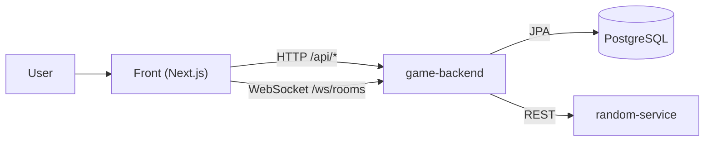

# Bonus Games

Игровой backend-модуль с комнатами, бонусным балансом, резервированием средств, выбором победителя через внешний random-service и realtime-событиями по WebSocket.

## Архитектура



## Сервисы и порты

- Front: [http://localhost:3000](http://localhost:3000)
- Game Backend: [http://localhost:8081](http://localhost:8081)
- Random Service: [http://localhost:9095](http://localhost:9095)
- PostgreSQL: `localhost:5432`

## Быстрый старт (Docker)

```bash
docker compose up --build
```

Проверка health:

```bash
curl -s http://localhost:8081/health
curl -s http://localhost:9095/api/random/health
```

Остановка:

```bash
docker compose down
```

Остановка с удалением volume БД:

```bash
docker compose down -v
```

## Минимальный сценарий проверки API

Регистрация:

```bash
curl -s -X POST "http://localhost:8081/api/auth/register" \
  -H "Content-Type: application/json" \
  -d '{
    "username": "denis",
    "password": "secret123",
    "role": "USER"
  }'
```

Логин:

```bash
curl -s -X POST "http://localhost:8081/api/auth/login" \
  -H "Content-Type: application/json" \
  -d '{
    "username": "denis",
    "password": "secret123"
  }'
```

Профиль:

```bash
curl -s "http://localhost:8081/api/profile/me" \
  -H "Authorization: Bearer <TOKEN>"
```

## Документация

- Стартовая страница docs: [docs/README.md](./docs/README.md)
- Руководство пользователя: [docs/USER.md](./docs/USER.md)
- Обзор проекта: [docs/OVERVIEW.md](./docs/OVERVIEW.md)
- Архитектура: [docs/ARCHITECTURE.md](./docs/ARCHITECTURE.md)
- Пользователь и кошелек: [docs/USER_WALLET.md](./docs/USER_WALLET.md)
- Комнаты и игровой цикл: [docs/ROOMS_GAME_FLOW.md](./docs/ROOMS_GAME_FLOW.md)
- API: [docs/API_REFERENCE.md](./docs/API_REFERENCE.md)
- WebSocket: [docs/WEBSOCKET_REALTIME.md](./docs/WEBSOCKET_REALTIME.md)
- Админка шаблонов: [docs/ADMIN_ROOM_TEMPLATES.md](./docs/ADMIN_ROOM_TEMPLATES.md)
- Интеграция в ЛК: [docs/INTEGRATION_GUIDE.md](./docs/INTEGRATION_GUIDE.md)
- Деплой: [docs/DEPLOYMENT.md](./docs/DEPLOYMENT.md)

## Детальные backend-доки

- Комнаты: [game-backend/ROOMS.md](./game-backend/ROOMS.md)
- WebSocket: [game-backend/WEBSOCKET.md](./game-backend/WEBSOCKET.md)
- Журнал игр: [game-backend/JOURNAL.md](./game-backend/JOURNAL.md)
