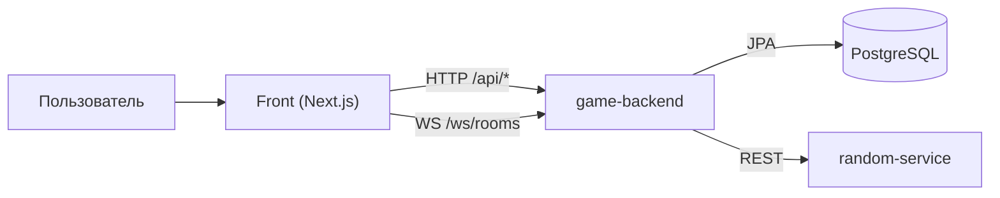

# Архитектура

## Высокоуровневая схема

## Компоненты game-backend

- `Auth` — регистрация, логин, токен-сессии, роли.
- `Wallet` — баланс, резервирование, commit/release, транзакции.
- `Rooms` — подбор/создание комнат, вход, места, таймер, боты.
- `Winner` — расчет весов и выбор победителя через `random-service`.
- `Journal` — запись итогов раунда и событий.
- `Room Templates` — конфигурации комнат и админ-управление.
- `Realtime` — push состояния комнаты и событий по WebSocket.

## Принципы

- Финансовые операции идемпотентны через `operationId`.
- Все важные действия логируются в БД (финансы + игровые события).
- `random-service` отделен, чтобы масштабировать и валидировать рандом независимо.
- Данные комнаты и кошелька связаны через резервы и транзакции.

## Масштабирование

- Горизонтальное масштабирование `game-backend` и `random-service` (несколько инстансов за балансировщиком).
- PostgreSQL как централизованный источник истины.
- Stateless API-слой (сессионный токен хранится в БД, а не в памяти процесса).
