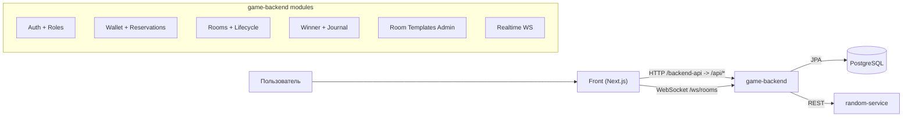
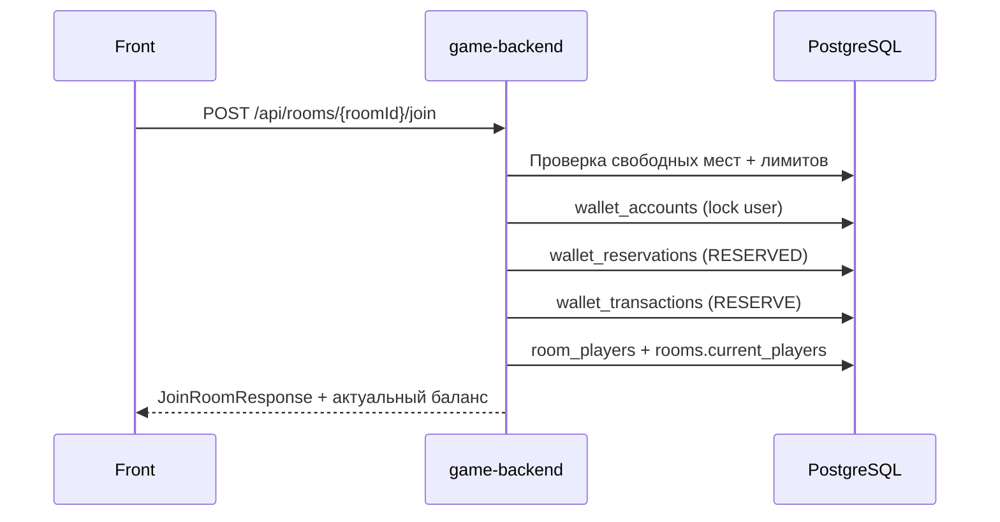
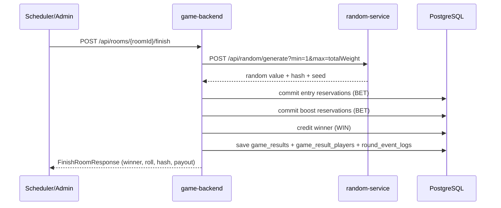

# Техническая документация проекта Bonus Games

## 1. Назначение проекта

Проект реализует игровой модуль комнат с бонусными баллами:

- регистрация/авторизация пользователей;
- учет баланса бонусных баллов;
- резервирование и финализация (commit/release) бонусных баллов;
- управление комнатами и шаблонами комнат;
- розыгрыш победителя с использованием внешнего random-service;
- хранение истории игр и событий;
- realtime-обновления состояния комнаты через WebSocket.

Проект состоит из 3 приложений:

- `game-backend` (Spring Boot, порт `8081`);
- `random-service` (Spring Boot, порт `9095`);
- `front` (Next.js, порт `3000`).

База данных: PostgreSQL (`5432`).

## 2. Технологический стек

- Java 17
- Spring Boot 3
- Spring Web (REST API)
- Spring WebSocket
- Spring Data JPA + Hibernate
- Flyway (миграции)
- PostgreSQL
- Maven
- Docker / Docker Compose
- Frontend: Next.js + TypeScript

## 3. Высокоуровневая архитектура



### 3.1 Основные backend-модули

- `Auth`: токены сессии, роли (`USER`, `EXPERT`, `ADMIN`).
- `Wallet`: баланс, резервы, транзакции, начисления выигрыша.
- `Rooms`: подбор комнаты, присоединение, таймер, бусты, боты, завершение.
- `Winner`: вычисление победителя по весам с внешним random-service.
- `Journal`: хранение результатов раунда и событий.
- `Room Templates`: админ-управление конфигурациями комнат.
- `Realtime`: push состояния и событий комнаты по WebSocket.

## 3.2 Требования из ТЗ (чек-лист)

Ниже перечислены пункты, которые обязательно отражены в архитектуре:

- Какие данные о пользователе нужны модулю — см. раздел `7.1`.
- Как передается баланс бонусных баллов — см. раздел `7.2`.
- Как выполняется резервирование бонусных баллов — см. раздел `7.3`.
- Как фиксируются операции списания и начисления — см. раздел `7.4`.
- Какой API нужен для запуска раунда и определения победителя — см. раздел `6.2`.
- Как хранится история участий — см. раздел `8`.
- Как администратор управляет конфигурациями комнат — см. раздел `9`.
- Как модуль может быть встроен в существующий личный кабинет или игровой раздел — см. раздел `13`.

## 4. Модель данных (ключевые сущности)

### 4.1 Пользователь и доступ

- `users`:
  - `id` (UUID)
  - `username`
  - `password_hash`
  - `role`
  - `created_at`, `updated_at`
- `auth_sessions`:
  - `token`
  - `user_id`
  - `expires_at`

### 4.2 Баланс и финансовые операции

- `wallet_accounts`:
  - `user_id`
  - `available_balance`
  - `reserved_balance`
- `wallet_reservations`:
  - `id`, `user_id`, `room_id`, `round_id`, `amount`
  - `status` (`RESERVED`, `RELEASED`, `COMMITTED`)
  - `operation_id` (уникальный)
- `wallet_transactions`:
  - `type` (`DEPOSIT`, `RESERVE`, `RELEASE`, `BET`, `BOOST_PURCHASE`, `WIN`, `ADJUSTMENT`)
  - `amount`, `operation_id`, `reservation_id`

### 4.3 Игровая доменная модель

- `room_templates` (конфиги комнат)
- `rooms` (созданные комнаты)
- `room_players` (участники комнаты/места)
- `game_results` (итоги раунда)
- `game_result_players` (итоги по каждому участнику)
- `round_event_logs` (журнал событий)

## 5. Жизненный цикл комнаты

### 5.1 Создание и подбор

- Комната создается по шаблону: `POST /api/rooms/create`.
- Подбор/создание без присоединения: `POST /api/room/find`.

Логика `find`:

1. Ищется `WAITING` комната по шаблону/параметрам.
2. Проверяется наличие мест (`seats` или `seatsCount`).
3. Проверяется, что до конца таймера > 5 секунд.
4. Если подходящей нет — создается новая.
5. Пользователь не присоединяется автоматически.

### 5.2 Присоединение

`POST /api/rooms/{roomId}/join`:

- резервирует стоимость входа (`entryCost * seatsCount`);
- назначает места (`playerOrder`);
- при первом игроке стартует таймер (`firstPlayerJoinedAt`);
- запрещает вход при остатке времени <= 5 секунд;
- ограничивает пользователя максимум 50% мест комнаты.



### 5.3 Таймер и завершение

- Таймер комнаты: `timerSeconds = 60`.
- Старт таймера: после входа первого игрока.
- Периодическая проверка таймаута: scheduler каждые 5 секунд.
- Если таймаут наступил:
  - если комната не полная — свободные места заполняются ботами;
  - затем вызывается финализация раунда (`finishRoom`).

## 6. Определение победителя

### 6.1 Алгоритм

Для каждого участника вес:

- `weight = baseWeight + boostBonus`, если `boostUsed=true`
- иначе `weight = baseWeight`

По умолчанию:

- `baseWeight = 100`
- `boostBonus = 10`

Случайное число берется из `random-service`:

- `POST /api/random/generate?min=1&max=totalWeight`

Далее выбирается индекс победителя по диапазонам весов.

### 6.2 API для запуска раунда и выбора победителя

Есть два сценария:

1. Боевой (основной):
- `POST /api/rooms/{roomId}/finish`
- Выполняет полный цикл: commit резервов, выбор победителя, начисление выигрыша, журнал.

2. Сервисный/тестовый:
- `POST /api/game/winner`
- Возвращает расчет победителя для переданного списка игроков (без полного жизненного цикла комнаты).



## 7. Балансы, резервирование, списания и начисления

## 7.1 Какие данные о пользователе нужны модулю

Минимально необходимые данные:

- `userId` (UUID) — идентификатор пользователя;
- `username` — отображение и история;
- `role` — доступ к API и админ-функциям;
- `password_hash` — только для локальной схемы логина/регистрации.

Для финансовой части:

- связанный `wallet_account` (available/reserved);
- при операциях — `operationId` (идемпотентность и аудит).

## 7.2 Как передается баланс бонусных баллов

Баланс передается в структурах `BalanceResponse`:

- `available`
- `reserved`
- `total`

Где возвращается:

- `POST /api/auth/register` (в `AuthResponse.balance`)
- `POST /api/auth/login` (в `AuthResponse.balance`)
- `GET /api/profile/me` (в `ProfileResponse.balance`)
- `GET /api/wallet/balance`
- `POST /api/wallet/deposit`
- ответы reserve/commit/release (`ReservationResponse.balance`)

## 7.3 Как выполняется резервирование бонусных баллов

Резервирование выполняется через `wallet_reservations`:

1. Проверка `available_balance >= amount`.
2. Перемещение суммы:
   - `available -= amount`
   - `reserved += amount`
3. Создание записи `wallet_reservations` со статусом `RESERVED`.
4. Фиксация транзакции типа `RESERVE`.

API:

- Универсально: `POST /api/wallet/reserve`
- В игровом потоке:
  - при входе в комнату (entry reservation)
  - при активации буста для места (boost reservation)

## 7.4 Как фиксируются операции списания и начисления

Все движения фиксируются в `wallet_transactions`:

- `DEPOSIT` — тестовое пополнение;
- `RESERVE` — создание резерва;
- `RELEASE` — возврат резерва;
- `BET` — commit ставки/входа/буста;
- `WIN` — начисление победителю;
- `BOOST_PURCHASE` — отдельный тип (поддержан сервисом, но в текущем комнатном потоке используется резервация + `BET`).

При завершении комнаты:

- entry-резервы участников -> `COMMITTED` + `BET`;
- boost-резервы -> `COMMITTED` + `BET`;
- победителю -> `WIN`.

При отмене комнаты:

- все резервы -> `RELEASED` + `RELEASE`.

## 8. История участий и журнал

## 8.1 Как хранится история участий

История хранится в:

- `game_results` — запись раунда;
- `game_result_players` — участники раунда, веса, баланс до/после, delta;
- `round_event_logs` — лента событий (создание комнаты, вход, буст, финиш и т.д.).

## 8.2 API истории

- Админ/эксперт:
  - `GET /api/game/journal`
  - `GET /api/game/journal/{id}`
  - `GET /api/game/journal/{id}/events`
  - `GET /api/game/journal/events/by-room?roomId=...`
- Пользователь:
  - `GET /api/game/journal/me`
  - `GET /api/game/journal/me/{id}`
  - `GET /api/game/journal/me/{id}/events`
  - `GET /api/game/journal/me/win-streak`

## 9. Администрирование конфигураций комнат

## 9.1 Как администратор управляет конфигурациями комнат

Эндпоинты (`/api/room-templates`):

- `POST /api/room-templates` — создать шаблон (`ADMIN`)
- `PUT /api/room-templates/{id}` — обновить (`ADMIN`)
- `DELETE /api/room-templates/{id}` — деактивировать (`active=false`, soft delete) (`ADMIN`)
- `GET /api/room-templates` — список только активных шаблонов
- `GET /api/room-templates/{id}` — шаблон по id
- `GET /api/room-templates/entry-costs` — список доступных entry-cost

Параметры шаблона:

- `entryCost`
- `bonusEnabled`, `bonusPrice`, `bonusWeight`
- `maxPlayers`
- `winnerPercent`
- `gameMechanic`

Расчетный `prizeFund` в ответе шаблона:

- `prizeFund = entryCost * maxPlayers * winnerPercent / 100`

## 10. Realtime-модель

WebSocket endpoint:

- `ws://<host>:8081/ws/rooms?roomId=<UUID>&token=<BearerToken>`

Типы сообщений:

- `ROOM_STATE` — состояние комнаты, таймер, места, игроки, расчетные метрики;
- `ROOM_EVENTS` — журнал событий комнаты.

Частота:

- initial snapshot сразу при подключении;
- `ROOM_STATE` раз в 1 секунду только при активном таймере;
- иначе push только по событиям.

## 11. Расчетные метрики буста

На уровне комнаты возвращаются:

- `currentChancePercent`
- `chanceWithBoostPercent`
- `boostAbsoluteGainPercent`

Формулы:

- `currentChancePercent = 100 / maxPlayers`
- `chanceWithBoostPercent = (baseWeight + boostWeight) / (baseWeight * (maxPlayers - 1) + (baseWeight + boostWeight)) * 100`
- `boostAbsoluteGainPercent = chanceWithBoostPercent - currentChancePercent`
- `baseWeight = 100`

## 12. Внешний random-service

`random-service` предоставляет:

- `POST /api/random/generate?min=&max=&count=`
- `GET /api/random/replay/{hash}`
- `GET /api/random/health`

`game-backend` обращается к нему через `RandomClient` (`app.random-service.base-url`).

Важно: в текущей реализации random-service хранит generated records в памяти процесса (in-memory map), поэтому replay зависит от жизненного цикла инстанса.

## 13. Встраивание в существующий ЛК / игровой раздел

## 13.1 Как модуль может быть встроен в существующий личный кабинет

Рекомендуемый интеграционный контракт:

1. ЛК получает/хранит токен пользователя (`Bearer`).
2. ЛК запрашивает профиль и баланс:
   - `GET /api/profile/me`
   - `GET /api/wallet/balance`
3. Игровой раздел:
   - `POST /api/room/find` -> получить roomId/параметры
   - `POST /api/rooms/{roomId}/join` -> занять места
   - `POST /api/rooms/{roomId}/boost/activate` -> купить буст на место
4. Realtime-экран комнаты:
   - WebSocket `/ws/rooms?...`
5. История игрока:
   - `GET /api/game/journal/me`

В проекте `front` реализован BFF-proxy слой (`/backend-api/[...path]`), который проксирует запросы в `game-backend`. Такой же подход можно использовать в существующем ЛК.

## 13.2 Как модуль может быть встроен в игровой раздел

Минимальные UI-блоки:

- Авторизация / сессия
- Баланс (available/reserved/total)
- Подбор/создание комнаты
- Выбор мест и присоединение
- Активация буста
- Realtime состояние комнаты (таймер, места, события)
- Экран результата и история

## 14. API-карта (ключевые группы)

### 14.1 Public / auth

- `POST /api/auth/register`
- `POST /api/auth/login`
- `GET /health`

### 14.2 User profile / wallet

- `GET /api/profile/me`
- `GET /api/wallet/balance`
- `POST /api/wallet/deposit`
- `POST /api/wallet/reserve`
- `POST /api/wallet/reservations/{id}/commit`
- `POST /api/wallet/reservations/{id}/release`

### 14.3 Rooms

- `POST /api/rooms/create`
- `POST /api/room/find`
- `POST /api/rooms/{roomId}/join`
- `POST /api/rooms/code/{shortId}/join`
- `POST /api/rooms/{roomId}/boost/activate`
- `POST /api/rooms/{roomId}/finish`
- `POST /api/rooms/{roomId}/cancel`
- `GET /api/rooms/*` (`state`, `events`, `waiting`, `filter`, `recommendations`)

### 14.4 Journal / analytics / configs

- `POST /api/game/winner`
- `GET/POST /api/game/journal*`
- `GET /api/dashboard*`
- `POST /api/config/test`
- `GET /api/config/report`
- `GET/POST/PUT/DELETE /api/room-templates*`

## 15. Безопасность и роли

- Перехватчик `AuthInterceptor` проверяет Bearer token для `/api/**` (кроме `/api/auth/**`, `/health`).
- Ролевой доступ через `RoleGuard`.

Роли:

- `USER` — игровые пользовательские операции.
- `EXPERT` — расширенный доступ (например, finish room, аналитика).
- `ADMIN` — управление ролями и шаблонами, полный доступ.

## 16. Конфигурация и запуск

Переменные `game-backend`:

- `DB_URL`, `DB_USERNAME`, `DB_PASSWORD`
- `RANDOM_SERVICE_URL`
- `app.auth.token-ttl-hours` (по умолчанию 2400)

Переменные `random-service`:

- `APP_HASH_SECRET`

Локальный запуск:

```bash
docker compose up --build
```

Порты:

- Front: `3000`
- Game Backend: `8081`
- Random Service: `9095`
- PostgreSQL: `5432`

## 17. Дополнительные документы

- Детальная документация комнат и API: `game-backend/ROOMS.md`
- Детальная документация WebSocket: `game-backend/WEBSOCKET.md`
- Документация журнала раундов: `game-backend/JOURNAL.md`
