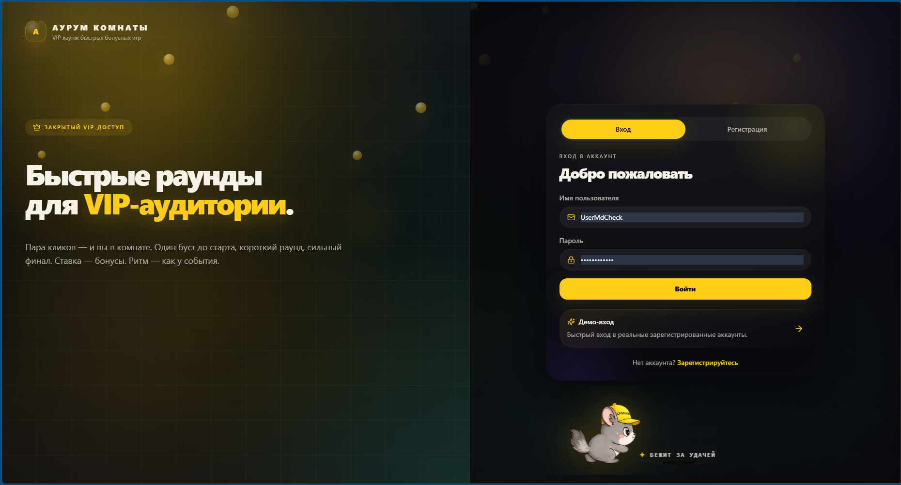
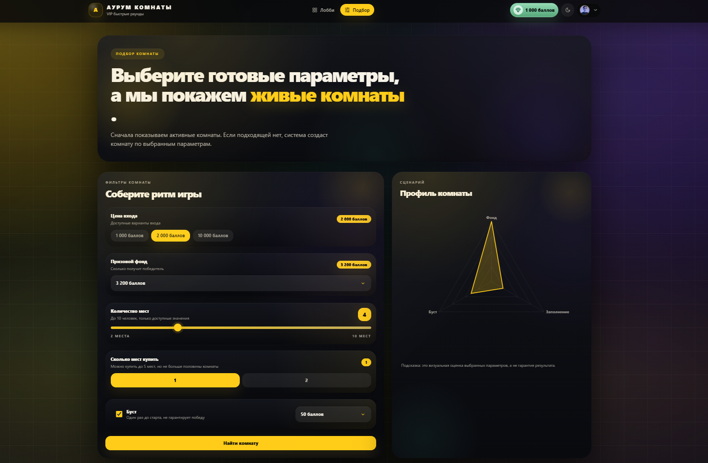
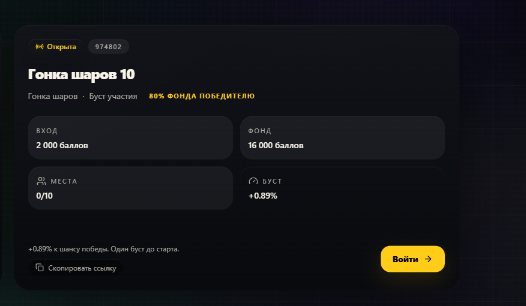
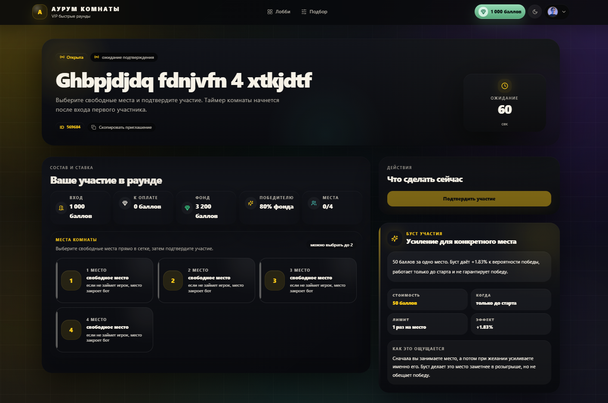

# Руководство пользователя

## Назначение

Это руководство показывает базовый путь пользователя в системе: вход в аккаунт, переход на главный экран, подбор комнаты по готовым параметрам и шаблонам, а затем вход в выбранную комнату.

## 1. Вход в систему

После открытия сайта пользователь попадает на экран авторизации. Здесь можно:

- войти в существующий аккаунт;
- перейти на вкладку регистрации и создать новый аккаунт;
- использовать демо-вход, если он доступен в интерфейсе.

Для входа нужно ввести имя пользователя и пароль, после чего нажать кнопку **«Войти»**.

## 2. Главный экран

После успешного входа открывается главный экран пользователя. На нём отображаются:

- текущий баланс;
- основная навигация по разделам;
- краткое описание механики сервиса;
- кнопки быстрого перехода к подбору или к списку активных комнат.

Главный экран служит стартовой точкой для перехода к игровому сценарию.

## 3. Подбор комнаты

Для поиска подходящей комнаты пользователь переходит в раздел **«Подбор»**. На этом экране можно задать основные параметры будущей игры:

- цену входа;
- размер призового фонда;
- количество мест;
- количество покупаемых мест;
- использование буста.

Подбор можно использовать как выбор по готовым параметрам и шаблонам комнаты. Пользователь задаёт подходящий профиль игры, а система сначала пытается показать уже существующие комнаты с такими характеристиками. Если подходящей комнаты нет, система может создать новую по выбранному сценарию.

## 4. Результат подбора

После нажатия кнопки **«Найти комнату»** система показывает подходящие варианты. На карточке комнаты пользователь видит:

- статус комнаты;
- идентификатор комнаты;
- тип сценария;
- стоимость входа;
- размер фонда;
- текущее количество занятых мест;
- параметры буста.

Для перехода внутрь комнаты нужно нажать кнопку **«Войти»**.

## 5. Экран комнаты

После входа открывается экран комнаты. Здесь пользователь выполняет основные действия перед началом раунда:

- просматривает параметры участия;
- выбирает свободное место;
- подтверждает участие;
- при необходимости включает буст для конкретного места.

На экране также отображаются:

- таймер ожидания;
- стоимость участия;
- фонд раунда;
- количество мест;
- размер выигрыша для победителя;
- условия использования буста.

Именно этот экран является основной рабочей зоной перед стартом игрового раунда.

## Примечание

Если в системе уже есть подходящая активная комната, пользователь попадает в неё сразу. Если подходящей комнаты нет, система создаёт новую на основе выбранных параметров подбора.
